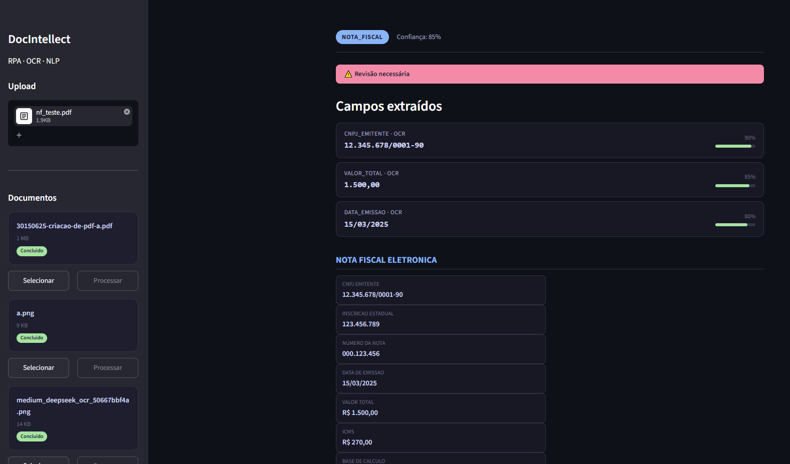

# DocIntellect RPA

Plataforma de RPA inteligente para processamento e extração automatizada de dados de documentos utilizando OCR + NLP.

## Stack

| Camada | Tecnologia |
|---|---|
| API | FastAPI |
| OCR | Tesseract / PaddleOCR (fallback) |
| Extração | Regex + LLM (OpenAI, fallback opcional) |
| Parser | Heurística (tabelas, seções, KV, listas) |
| PDF | PyMuPDF (extração direta + renderização) |
| UI | Streamlit |
| Workers | Celery + Redis (opt-in) |
| Banco | PostgreSQL / SQLAlchemy (opt-in) |
| Armazenamento | Local / S3 (opt-in) |
| Infra | Docker Compose |

## Funcionalidades

- **Upload** de PDF, PNG, JPG, TIFF, BMP
- **Pipeline completo**: pré-processamento → OCR → classificação → extração → validação → parser inteligente
- **OCR dual**: Tesseract (default) com fallback automático para PaddleOCR
- **Classificação automática** de documentos: nota fiscal, contrato, laudo médico, identidade, recibo, boleto
- **Extração de campos** via regex + validação (CPF, CNPJ, datas, valores)
- **Parser inteligente**: detecta headers, tabelas, pares chave-valor, listas e parágrafos
- **LLM fallback**: usa OpenAI para extrair/estruturar quando a confiança está baixa (opcional)
- **Interface Streamlit**: sidebar com histórico, botão "Processar" por documento, resultados estruturados
- **API REST**: Swagger em `/docs`, endpoints de upload e processamento
- **Workers assíncronos**: Celery + Redis para processamento em background (opt-in)

## Início Rápido

### Windows

```bash
# 1. Clone
git clone https://github.com/LuzaniDev/DocIntellect.git
cd DocIntellect

# 2. Setup automático
setup.bat

# 3. Configure o .env com os paths do Tesseract (veja .env.example)

# 4. Rode
python run.py
```

### Linux / macOS

```bash
# 1. Clone
git clone https://github.com/LuzaniDev/DocIntellect.git
cd DocIntellect

# 2. Dependências
make setup

# 3. Configure o Tesseract
cp .env.example .env
# Edite TESSERACT_CMD e TESSDATA_PREFIX no .env

# 4. Rode
make run
```

### Docker (completo)

```bash
docker compose -f docker/docker-compose.yml up -d
```

Requer PostgreSQL + Redis rodando nos containers.

## Como usar

1. Abra http://127.0.0.1:8501
2. Faça upload de um PDF ou imagem (NF, contrato, laudo, etc.)
3. Clique em **Processar** na barra lateral
4. Visualize os campos extraídos, tabelas, pares chave-valor e texto bruto



## API

| Método | Rota | Descrição |
|---|---|---|
| GET | `/health` | Health check |
| POST | `/api/v1/documents/upload` | Upload de documento |
| POST | `/api/v1/documents/process/{id}` | Processar e extrair dados |

Swagger em http://127.0.0.1:8000/docs

## Estrutura

```
app/
├── api/               → FastAPI (rotas, schemas, dependências)
│   ├── routes/        →   health, documents
│   ├── schemas/       →   DocumentResponse, ExtractionResponse
│   └── dependencies/  →   container DI
├── core/              → Config (pydantic-settings), logging (loguru), database (SQLAlchemy)
├── domain/            → Modelos de negócio (Document, Extraction, Validation)
├── extractors/        → Motores de extração
│   ├── ocr/           →   Tesseract, PaddleOCR, factory com fallback
│   ├── nlp/           →   Classificador, EntityExtractor via regex
│   ├── llm_fallback/  →   OpenAI fallback
│   ├── document_parser.py  → Parser heurístico (tabelas, seções, KV, listas)
│   └── smart_parse.py →   Parser inteligente (heurística + LLM)
├── pipeline/          → Orquestrador com stages
│   └── stages/        →   preprocessing, ocr, classification, extraction, validation
├── storage/           → LocalStorage (S3 futuro)
├── ui/                → Streamlit (app.py)
└── workers/           → Celery tasks (opt-in)
```

## Licença

MIT
